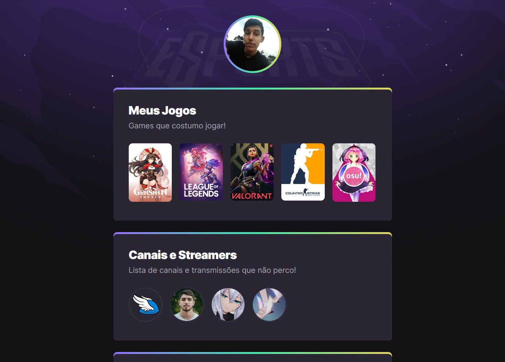

# NLW eSports 

>Trilha Explorer

Projeto construído do evento Next Level Week da Rocketseat.

[🔗 Acesse o projeto 😃](https://MatheusSamburskiGrendene.github.io/NLW-Esports)

## 👨‍💻 Tecnologias

- HTML
- CSS
- Git
- Github

## Oque aprendi? 🤔

Aprendi a montar um código fácil e um layout responsivo usando HTML e CSS, usei um pouco do Figma para puxar os estilos e fontes do site e por final aprendi a criar um repositório no Github e a montar um README.md que é este que você está vendo agora 😃.

## 📱 Contato

matheus.samburski@grendene.com.br